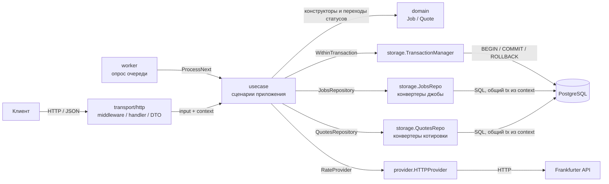
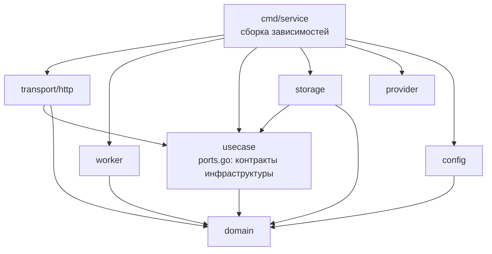
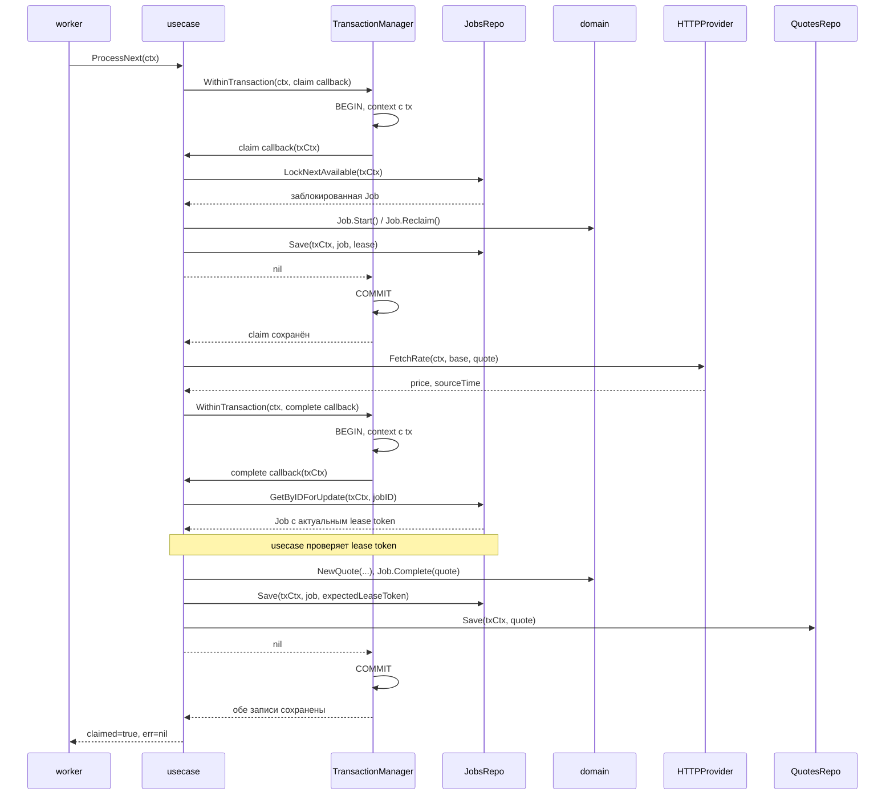

# currency-quotes

Асинхронный HTTP-сервис котировок валютных пар. Запрос создаёт задачу и сразу
возвращает её идентификатор. Воркеры получают курс и сохраняют результат в
PostgreSQL; клиент проверяет результат отдельным запросом.

## Архитектура

Вызовы между слоями во время работы сервиса:

Usecase вызывает репозитории внутри callback менеджера транзакций. Менеджер
передаёт общий `pgx.Tx` через контекст; репозитории выполняют SQL в этой
транзакции. Для `GetLatest` достаточно одного чтения через пул. Проверка
`/readyz` вызывает переданный из `cmd/service` callback `pool.Ping`.

Направление импортов Go-пакетов отличается от направления вызовов:

Стрелки на второй схеме означают импорты внутренних пакетов. Usecase зависит
от домена и собственных интерфейсов; реализации передаются в `cmd/service`.
`worker` вызывает usecase через свой интерфейс `JobProcessor`, поэтому ему
не нужен импорт пакета `usecase`. Реализации удовлетворяют интерфейсам
структурно. `storage` импортирует `usecase` для типа `JobUpdate`; `provider`
не импортирует внутренние пакеты приложения. Домен не импортирует остальные
слои приложения.

Один процесс `cmd/service` обслуживает HTTP и запускает воркеры. Обработчики
используют `net/http` и chi, напрямую вызывая `internal/usecase`. Хранилище и
очередь находятся в `internal/storage`, получение курса — в `internal/provider`,
сценарии фоновой обработки — в `internal/usecase`. `internal/worker` только
опрашивает usecase и логирует ошибки.

В `internal/transport/http` роутер и middleware находятся в `router.go` и
`middleware.go`, HTTP-обработчики — в `handler.go`, DTO и конвертеры — в
`dto.go`, общий обработчик ошибок — в `error.go`.

Цепочка middleware: `Recoverer → RequestID → RequestLogger → RequestTimeout
→ BodyLimit → chi router → HTTP handler`. Recoverer установлен первым и
перехватывает паники во всей цепочке. Ошибки, возвращённые handler, попадают
в общий ErrorHandler. Он сохраняет единый JSON-формат и не заменяет ответ,
если заголовки уже отправлены. Panic-ответы используют тот же формат.

В контексте передаётся request ID; данные задачи передаются явно через
входные структуры use case. Конвертеры транспорта переводят JSON, URL и
заголовки во входы сценариев, а результаты — в HTTP DTO. Проверка валютной
пары остаётся в домене. Бизнес-обработчики транспорта передают операции с БД
в usecase; транзакциями управляет usecase через `TransactionManager`.

В usecase `quotes.go` содержит HTTP-сценарии, `jobs.go` — `ClaimPending`,
`CompleteJob`, `RetryJob` и полный сценарий `ProcessNext`; контракты двух
репозиториев, провайдера и менеджера транзакций находятся в `ports.go`.
Новые джобы и котировки создаются через конструкторы домена, переходы статусов
выполняют `Start`, `Reclaim`, `Complete`, `RetryOrFail` и `Fail`.

`storage.TransactionManager.WithinTransaction` открывает транзакцию и передаёт
её через приватный ключ контекста. Оба репозитория используют один `pgx.Tx`;
usecase не зависит от pgx. Ошибка или panic откатывает транзакцию. Claim
блокирует доступную строку через `FOR UPDATE SKIP LOCKED`; провайдер вызывается
после commit, затем complete в одной транзакции сохраняет джобу и котировку.
Complete и retry проверяют lease token под блокировкой строки. Репозитории
конвертируют доменные сущности в свои модели PostgreSQL и обратно.

Отдельного шлюза, gRPC, protobuf и генерации кода нет. Миграции запускаются
отдельной командой `cmd/migrate`. HTTP-контракт описан ниже.

## HTTP API

### Создать задачу обновления

    POST /v1/quote-updates
    Content-Type: application/json
    Idempotency-Key: client-request-42

    {"pair":"EUR/MXN"}

Новая задача возвращает `202 Accepted`:

    {"jobId":"b18e9a84-0cdf-46bb-889d-ed4a7235c367","status":"JOB_STATUS_PENDING"}

`Idempotency-Key` необязателен; максимальная длина — 128 байт. Повтор с тем же
ключом и парой возвращает исходную задачу с `200 OK`. Тот же ключ с другой
парой возвращает `409 Conflict`. Некорректный JSON и неизвестные поля дают
`400 Bad Request`; размер тела ограничен 1 MiB, превышение даёт `413`.

### Получить задачу и результат

    GET /v1/quote-updates/{job_id}

Ответ содержит `jobId`, `pair`, `status`. Статусы:
`JOB_STATUS_PENDING`, `JOB_STATUS_PROCESSING`, `JOB_STATUS_DONE`,
`JOB_STATUS_FAILED`.

Для завершённой задачи добавляются `price` и `updatedAt`. Для неуспешной задачи
добавляется публичное `errorMessage`. В остальных состояниях эти поля отсутствуют.
Несуществующая задача возвращает `404 Not Found`.

### Получить последнюю котировку

    GET /v1/quotes/latest?pair=EUR%2FMXN

    {"pair":"EUR/MXN","price":"19.12345678","updatedAt":"2026-09-30T09:00:00Z"}

Цена передаётся decimal-строкой без потери точности через JSON float.
`updatedAt` — время сохранения результата сервисом в RFC 3339 (UTC).
Если котировки ещё нет, возвращается `404 Not Found`.

По умолчанию разрешены EUR, MXN, USD. Список можно заменить через
`ALLOWED_CURRENCIES` в `deploy/.env.local`, например:

    ALLOWED_CURRENCIES=EUR,USD,GBP,CHF

Настройка применяется при создании задачи и запросе последней котировки.
Коды нормализуются в верхний регистр, пробелы вокруг кодов удаляются,
дубликаты исключаются. Требуются минимум два разных кода из трёх ASCII-букв;
пустой или некорректный список не позволяет запустить сервис.
Провайдер должен поддерживать заданные валюты. Пара имеет формат `BASE/QUOTE`;
валюты должны различаться. Регистр и пробелы вокруг пары нормализуются.
Существующие результаты не теряют валидность при изменении списка.

Ошибки возвращаются в JSON:

    {"code":"INVALID_ARGUMENT","message":"invalid currency pair: expected BASE/QUOTE","requestId":"..."}

Сервис принимает или генерирует `X-Request-ID` и возвращает его в заголовке.
Внутренние ошибки БД и провайдера не раскрываются клиенту. Для совместимости
код ошибки таймаута остался `GATEWAY_TIMEOUT` (HTTP 504).

### Проверки состояния

- `GET /healthz` — процесс жив.
- `GET /readyz` — PostgreSQL доступна; при ошибке подключения возвращается 503.

## Фоновая обработка

Успешная обработка одной джобы:

Во время вызова провайдера транзакция claim уже закрыта. При ошибке провайдера
usecase запускает отдельную транзакцию retry: блокирует джобу, проверяет lease,
вызывает `Job.RetryOrFail` и сохраняет статус с временем следующей попытки.
Ошибка внутри callback откатывает все его записи; ошибка claim или complete
не позволяет usecase вернуть успешный результат обработки.

`quote_jobs` служит очередью в PostgreSQL. `FOR UPDATE SKIP LOCKED` позволяет
воркерам забирать разные задачи. Lease и токен защищают от завершения задачи
устаревшим воркером; после сбоя процесса задачу можно забрать повторно.
Сохранение цены и перевод задачи в `done` выполняются одной транзакцией.
Временные ошибки повторяются с exponential backoff; после `MAX_ATTEMPTS`
задача становится `failed`.

Внешний API может вызываться повторно, но результат одной задачи сохраняется
один раз. HTTP-запрос не ожидает получения курса у провайдера.

По умолчанию используется Frankfurter-compatible endpoint
`https://api.frankfurter.app`. Base URL и таймаут настраиваются через
`PROVIDER_BASE_URL` и `PROVIDER_TIMEOUT`. Дата курса источника хранится отдельно
от времени сохранения результата.

## Локальный запуск

Создайте локальный ENV-файл:

    cp deploy/.env.local.example deploy/.env.local

Локальная PostgreSQL: `localhost:54322`, database/user/password — `postgres`.
Приложению требуется `DATABASE_DSN`; встроенного DSN с паролем нет.

Docker Compose запускает PostgreSQL, одноразовый migrator и HTTP-сервис.

Сервис называется `currency-service`. Оба исполняемых файла собираются в
`deploy/Dockerfile`: target `currency-service` имеет entrypoint
`/currency-service`, target `migrate` — `/migrate`. Compose выбирает нужный target.
Запуск:

    make docker-up
    make docker-ps
    make docker-logs

HTTP доступен на `localhost:8080` (порт задаётся `HTTP_PORT` в локальном ENV).
`docker-up` пересоздаёт контейнеры и удаляет устаревший контейнер gateway;
PostgreSQL volume сохраняется. Остановка без удаления данных:

    make docker-down

Для запуска Go-сервиса на хосте с уже запущенной локальной PostgreSQL:

    make migrate
    make run-service

Обе команды читают `deploy/.env.local` и подключаются к PostgreSQL через
`localhost`. `run-service` учитывает `HTTP_PORT`; адрес можно переопределить
через `HTTP_ADDR`. Установка buf/protoc и генерация перед сборкой не нужны.

## Настройки

| Переменная | По умолчанию |
| --- | --- |
| `ALLOWED_CURRENCIES` | `EUR,MXN,USD` |
| `HTTP_ADDR` | `:8080` |
| `HTTP_REQUEST_TIMEOUT` | `3s` |
| `HTTP_READ_TIMEOUT` | `5s` |
| `HTTP_WRITE_TIMEOUT` | `10s` |
| `HTTP_IDLE_TIMEOUT` | `60s` |
| `SHUTDOWN_TIMEOUT` | `10s` |
| `WORKER_COUNT` | `3` |
| `POLL_INTERVAL` | `500ms` |
| `JOB_LEASE_DURATION` | `30s` |
| `MAX_ATTEMPTS` | `5` |
| `RETRY_BASE` / `RETRY_MAX` | `1s` / `30s` |
| `PROVIDER_TIMEOUT` | `5s` |

`HTTP_REQUEST_TIMEOUT` ограничивает операции обработчика с БД, включая
readiness; чтение тела ограничивается `HTTP_READ_TIMEOUT`. При остановке
сервис завершает HTTP-запросы и ждёт остановки воркеров перед закрытием пула БД.

## Миграции и проверки

Изменения схемы добавляются новой парой `migrations/NNNN_name.up.sql` и
`migrations/NNNN_name.down.sql`. Старые применённые миграции не редактируются.
Migrator применяет новые `.up.sql` транзакционно и записывает версии в
`schema_migrations`; advisory lock защищает от одновременного запуска.
Автоматического rollback нет; `.down.sql` предназначены для ручного отката
после проверки последствий.

SQL встроен в migrator. После добавления миграции в Compose:

    docker compose --env-file deploy/.env.local -f deploy/docker-compose.yml build migrate
    docker compose --env-file deploy/.env.local -f deploy/docker-compose.yml run --rm --no-deps migrate

Локальные тесты и проверка кода:

    make test
    go test -race ./...
    go vet ./...

Интеграционные тесты нового usecase и PostgreSQL-репозиториев:

    go test -tags=integration ./internal/storage

Они требуют PostgreSQL только на `localhost:54322`, database/user/password —
`postgres`. Тесты создают временные таблицы в отдельном соединении; существующие
таблицы и данные приложения не меняются. Проверяются идемпотентность, rollback
обоих репозиториев, повторный claim просроченного lease и retry/backoff.
