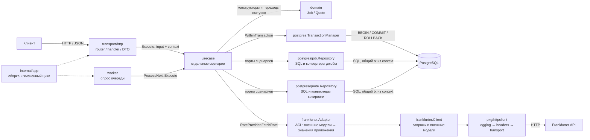
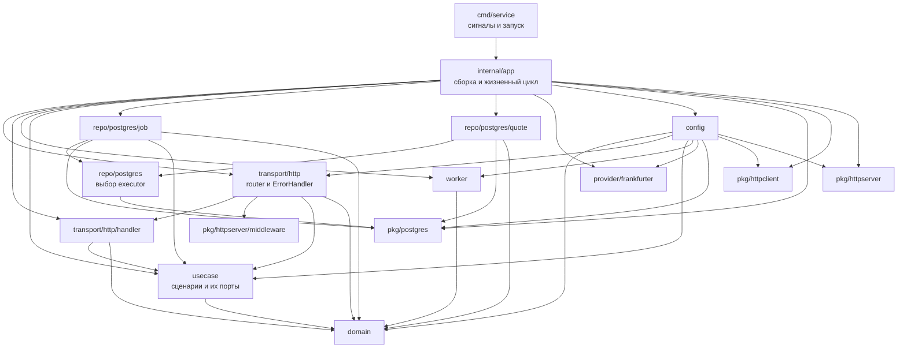

# Архитектура и границы слоёв

[Главная](../README.md) · [Документация](README.md) · [Домен](domain.md) · [Trade-offs](trade-offs.md)

В проекте старался использовать прагматичный DDD и clean подход: доменные правила отделены
от сценариев, а сценарии работают через порты. Здесь один процесс, одна БД
и один источник курсов. Дополнительные слои для простого проксирования вызовов
не требуются.

## Ответственность слоёв

| Слой | Что делает | Где проходит граница |
| --- | --- | --- |
| [domain](../internal/domain) | Создаёт сущности, проверяет инварианты, меняет статусы | Не знает об HTTP, SQL, конфиге процесса и источнике курсов |
| [usecase](../internal/usecase) | Оркестрирует сценарий, выбирает границы транзакций, обращается к портам | Не импортирует repo, pgx или Frankfurter |
| [transport/http](../internal/transport/http) | Читает запрос, формирует input, вызывает сценарий, возвращает DTO | Не выполняет SQL и не получает курс напрямую |
| [repo/postgres](../internal/repo/postgres) | Выполняет SQL, блокировки, атомарные операции и конвертацию моделей БД | Не выбирает бизнес-переходы статусов |
| [provider/frankfurter](../internal/provider/frankfurter) | Делает HTTP-запрос и переводит внешний ответ через ACL | Внешние JSON-модели не входят в домен или usecase |
| [worker](../internal/worker/worker.go) | Запускает сценарий по интервалу и логирует ошибки | Не работает с БД или HTTP-источником напрямую |
| [app](../internal/app/app.go) | Загружает конфиг, собирает зависимости, владеет ресурсами и shutdown | Не содержит правил пары или статусов |
| [pkg/postgres](../pkg/postgres) | Создаёт пул, выполняет begin/commit/rollback и передаёт tx через context | Не знает о Job, Quote и сценариях |
| [pkg/httpclient](../pkg/httpclient) | Создаёт HTTP client, применяет middleware заголовков и логов | Не знает URL и JSON Frankfurter; настройки получает из app |
| [pkg/httpserver](../pkg/httpserver) | Создаёт стандартный HTTP server и предоставляет общие middleware | Не знает маршруты и формат ошибок API; lifecycle остаётся в app |
| [config](../internal/config/config.go) | Читает ENV, проверяет настройки, нормализует список валют | Передаёт домену обычные значения, не глобальное состояние |

`cmd/service` оставляет себе логгер, системные сигналы и вызов `app.Run`.
Migrator остаётся отдельной командой [cmd/migrate](../cmd/migrate/main.go).

## Вызовы и зависимости

Вызовы между слоями во время работы сервиса:

Usecase вызывает репозитории внутри callback менеджера транзакций. Менеджер
передаёт общий `pgx.Tx` через контекст; репозитории выполняют SQL в этой
транзакции. Для `GetLatest` достаточно одного чтения через пул. Проверка
`/readyz` вызывает переданный из `internal/app` callback `pool.Ping`.
Пунктирные стрелки показывают сборку зависимостей; сплошные — вызовы.

Направление импортов Go-пакетов отличается от направления вызовов:

Стрелки на второй схеме означают импорты пакетов проекта. Usecase зависит
от домена и собственных интерфейсов; реализации передаются в `internal/app`.
`worker` вызывает usecase через свой интерфейс `JobProcessor`, поэтому ему
не нужен импорт пакета `usecase`. Реализации удовлетворяют интерфейсам
структурно. `repo/postgres/job` импортирует `usecase` для типа `JobUpdate`; `frankfurter`
не импортирует внутренние пакеты приложения. Домен не импортирует остальные
слои приложения. Пакеты `pkg` не импортируют `internal`; usecase продолжает
работать через собственный интерфейс `TransactionManager`. Общий
`ServiceConfig` использует типы настроек компонентов; они не импортируют
загрузчик. `RuntimeConfig` объявлен в `internal/config`, поэтому обратной
зависимости config → app нет. Подробнее — [структура конфигурации](configuration.md#structure).

Один процесс обслуживает HTTP и запускает воркеры. `internal/app` собирает
зависимости, запускает HTTP и воркеры и управляет их остановкой. Обработчики
используют `net/http` и chi, напрямую вызывая `internal/usecase`. Хранилище и
очередь находятся в `internal/repo/postgres/job`, котировки — в
`internal/repo/postgres/quote`, получение курса — в `internal/provider/frankfurter`,
сценарии фоновой обработки — в `internal/usecase`. `internal/worker` только
опрашивает usecase и логирует ошибки.

В `internal/transport/http` роутер находится в `router.go`, общий обработчик
ошибок, DTO ошибки и JSON writer — в `error.go`. Подпакет `handler` содержит
`handler.go` с обработчиками, `dto.go` только со структурами успешных ответов
и запросов, `converter.go` с преобразованиями, `ports.go` с интерфейсами
сценариев и структурой зависимостей. Обработчик возвращает ошибку;
`ErrorHandler.Adapt` превращает её в HTTP-ответ. JSON writer передаётся в
конструктор handler функцией, поэтому обратного импорта `handler → http` нет. Общие middleware находятся в
[pkg/httpserver/middleware](../pkg/httpserver/middleware): Recoverer, RequestID,
Logger, Timeout и BodyLimit, каждый в отдельном файле. Роутер собирает их
цепочку и передаёт Recoverer callback, вызывающий свой ErrorHandler.
Лимит тела 1 MiB задаётся в роутере; BodyLimit принимает размер параметром.

Цепочка middleware: `Recoverer → RequestID → Logger → Timeout
→ BodyLimit → chi router → HTTP handler`. Recoverer установлен первым и
перехватывает паники во всей цепочке. Ошибки, возвращённые handler, попадают
в общий ErrorHandler. Он сохраняет единый JSON-формат и не заменяет ответ,
если заголовки уже отправлены. Panic-ответы используют тот же формат.

## Middleware и контекст

В контексте передаётся request ID; данные задачи передаются явно через
входные структуры use case. Конвертеры транспорта переводят JSON, URL и
заголовки во входы сценариев, а результаты — в HTTP DTO. Проверка валютной
пары остаётся в домене. Бизнес-обработчики транспорта передают операции с БД
в usecase; транзакциями управляет usecase через `TransactionManager`.

`RequestID` создаёт производный контекст через `WithValue`, затем
`Timeout` добавляет deadline через `WithTimeout`. Handler получает
этот контекст из `r.Context()` и передаёт его в `Execute`. Middleware не
разбирают пару и не загружают джобу в контекст.

Внутри `WithinTransaction` появляется ещё один производный контекст с
приватным ключом `pkg/postgres` для `pgx.Tx`. Usecase получает `txCtx`, но не извлекает
из него SQL-объект. Так один контекст переносит отмену и технические данные,
а бизнес-вход остаётся явной структурой. Worker использует свой контекст,
который не наследует deadline уже завершённого POST.

`Timeout` отменяет операции, которые учитывают контекст; он не
останавливает произвольную горутину и не прерывает чтение тела отдельно
от серверных read timeouts. Подробнее — [конфигурация](configuration.md#variables).

## Сценарии и их порты

Каждый usecase — отдельный сценарий со своим конструктором и методом `Execute`:
`request_update.go`, `get_job_result.go`, `get_latest.go`, `claim_pending.go`,
`complete_job.go`, `retry_job.go` и `process_next.go`. `ProcessNext` оркестрирует
claim, обращение к источнику и complete либо retry. Узкие интерфейсы репозиториев
объявлены рядом со сценариями, которые их используют; `RateProvider` — в
`process_next.go`. Общий контракт транзакций находится в
[transaction.go](../internal/usecase/transaction.go), метаданные сохранения
джобы — в [job_update.go](../internal/usecase/job_update.go).
Новые джобы и котировки создаются через конструкторы домена, переходы статусов
выполняют `Start`, `Reclaim`, `Complete`, `RetryOrFail` и `Fail`.

| Сценарий | Действия и зависимости |
| --- | --- |
| [RequestUpdate](../internal/usecase/request_update.go) | Создать доменную Job, атомарно сохранить или получить по ключу; `JobCreator`, `TransactionManager` |
| [GetJobResult](../internal/usecase/get_job_result.go) | Прочитать Job и, если done, Quote в транзакции; `JobReader`, `QuoteByJobReader`, `TransactionManager` |
| [GetLatest](../internal/usecase/get_latest.go) | Проверить пару и прочитать последний результат; `LatestQuoteReader` |
| [ClaimPending](../internal/usecase/claim_pending.go) | Забрать доступную Job, вызвать Start/Reclaim, сохранить lease; `JobClaimer`, `TransactionManager` |
| [CompleteJob](../internal/usecase/complete_job.go) | Проверить claim, создать Quote и завершить Job в одной транзакции; `JobUpdater`, `QuoteWriter`, `TransactionManager` |
| [RetryJob](../internal/usecase/retry_job.go) | Проверить claim, вызвать доменный retry/fail, назначить следующий запуск; `JobUpdater`, `TransactionManager` |
| [ProcessNext](../internal/usecase/process_next.go) | Соединить claim, источник и complete/retry; сценарии выше и `RateProvider` |

Интерфейс определяется там, где его используют. HTTP handler объявляет три
узких интерфейса `Execute` в [ports.go](../internal/transport/http/handler/ports.go), worker
— свой `JobProcessor`. Адаптер Frankfurter объявляет `rateClient`, HTTP-клиент
— `httpDoer`. Конкретные типы удовлетворяют им структурно, без общего
реестра интерфейсов или обязательного импорта пакета потребителя.

Разделение на файлы следует действиям, а не таблицам: `GetJobResult` и
`CompleteJob` используют и джобу, и котировку. Два репозитория означают две
области хранения, но не два набора бизнес-сценариев.

## Конвертеры и валидация

| Граница | Преобразование |
| --- | --- |
| HTTP → usecase | JSON/URL/заголовки → типизированный input в [converter.go](../internal/transport/http/handler/converter.go) |
| Usecase → domain | Конструкторы `NewJob`, `NewQuote`; уже загруженные сущности используют методы переходов |
| Domain ↔ repo | Внутренние `jobModel`/`quoteModel`, UUID и строковое представление decimal |
| Frankfurter → usecase | `latestResponse` → decimal и время через [Adapter](../internal/provider/frankfurter/adapter.go) |
| Usecase → HTTP | Результат → публичный DTO и строковые статусы |

Проверки формата JSON принадлежат транспорту, смысл пары и переходов — домену,
валидность протокола источника — ACL. SQL-блокировки и уникальные индексы
защищают конкурентные операции. Usecase проверяет актуальность claim перед
изменением сущности. Поэтому «правила в домене» не означает, что транспорт,
адаптер или репозиторий должны принимать любой некорректный ввод.

## Транзакции и композиция

`postgres.TransactionManager.WithinTransaction` открывает транзакцию и передаёт
её через приватный ключ контекста. Оба репозитория используют один `pgx.Tx`;
usecase не зависит от pgx. Ошибка или panic откатывает транзакцию. Claim
блокирует доступную строку через `FOR UPDATE SKIP LOCKED`; провайдер вызывается
после commit, затем complete в одной транзакции сохраняет джобу и котировку.
Complete и retry проверяют lease token под блокировкой строки. Репозитории
конвертируют доменные сущности в свои модели PostgreSQL и обратно.

[pool.go](../pkg/postgres/pool.go) создаёт пул и проверяет подключение.
[executor.go](../internal/repo/postgres/executor.go) выбирает tx или пул для чтения;
запись и блокировки требуют `postgres.RequireTransaction`. Подпакеты
[job](../internal/repo/postgres/job) и [quote](../internal/repo/postgres/quote)
содержат `repository.go` с SQL и Scan, `model.go` с приватной моделью БД и
`converter.go` с преобразованиями в домен и обратно. Родительский пакет
executor не импортирует эти репозитории; app собирает их напрямую.

[httpclient.New](../pkg/httpclient/client.go) возвращает `*http.Client` с
отдельным transport и цепочкой middleware. Заголовки и сообщение логов
Frankfurter задаются в `internal/app`, URL и внешний JSON остаются в провайдере.
[httpserver.New](../pkg/httpserver/server.go) возвращает `*http.Server` с
переданным handler и настройками. Listener, BaseContext, запуск и shutdown
остаются в `internal/app/lifecycle.go`.

Отдельного шлюза, gRPC, protobuf и генерации кода нет. Миграции запускаются
отдельной командой `cmd/migrate`. См. [контракт HTTP](api.md),
[последовательность фоновой обработки](jobs.md#processing) и
[запуск и завершение процесса](lifecycle.md).
