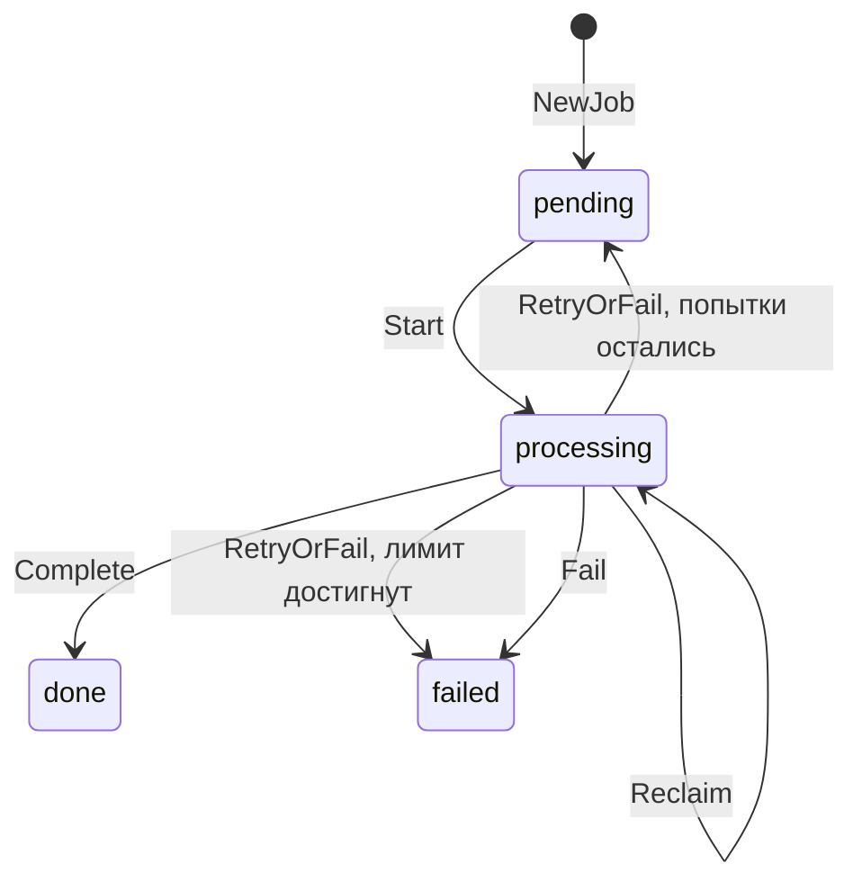

# Доменная модель

[Главная](../README.md) · [Документация](README.md) · [Архитектура](architecture.md) · [Джобы](jobs.md)

Домен описывает задачу получения курса и её результат. Правила находятся
в двух файлах: [job.go](../internal/domain/job.go) и [quote.go](../internal/domain/quote.go).
Здесь нет SQL, HTTP, JSON-моделей источника или управления горутинами.

## Идентификаторы

`JobID` и `QuoteID` — разные именованные типы на основе UUID. Это позволяет
отличать идентификатор задачи от идентификатора котировки в сигнатурах.
Для обоих есть генерация, разбор строки и `String()`. Парсинг отвергает
невалидный UUID и нулевой UUID.

`LeaseToken` также UUID, но обозначает конкретную попытку обработки, а не
идентичность джобы. При повторном claim токен меняется. Его назначение описано
в [защите от устаревшего воркера](jobs.md#lease).

## Job: задача получения курса

| Поле | Значение |
| --- | --- |
| `ID` | Идентификатор джобы |
| `Pair` | Нормализованная пара, например `GBP/CHF` |
| `IdempotencyKey` | Ключ повторного запроса; может быть пустым |
| `Status` | `pending`, `processing`, `done` или `failed` |
| `ErrorMessage` | Публичная причина неуспеха |
| `Attempts` | Число начатых попыток, включая повторный claim |
| `LeaseToken` | Токен текущей попытки |
| `CreatedAt`, `UpdatedAt` | Время создания и последнего перехода в UTC |

`NewJob` проверяет пару и длину ключа идемпотентности, генерирует ID и время,
создаёт задачу в `pending` с нулевым числом попыток. Максимальная длина ключа
— 128 байт. Конфликт одинакового ключа с разными парами определяется
сценарием после атомарного обращения к репозиторию, поскольку требует
знания уже сохранённых данных.

Поля открыты: модель остаётся простой Go-структурой без набора getters.
Сценарии меняют бизнес-состояние через методы модели. Репозитории восстанавливают
структуру из БД через конвертеры; они не вызывают конструктор новой сущности
и не генерируют ей новый ID.

## Допустимые переходы статусов

| Метод | Условия и результат |
| --- | --- |
| `Start()` | Только из `pending`; увеличивает `Attempts` и переводит в `processing` |
| `Reclaim()` | Только из `processing`; увеличивает `Attempts`, сохраняя статус |
| `Complete(quote)` | Только из `processing`; проверяет котировку и совпадение её `JobID` и `Pair`, переводит в `done` |
| `RetryOrFail(maxAttempts, message)` | Только из `processing`; возвращает в `pending`, если попытки остались, иначе переводит в `failed` |
| `Fail(message)` | Только из `processing`; сразу переводит в `failed` |

Все переходы требуют ненулевого ID и корректного числа попыток; для
`processing` число попыток должно быть положительным. Повтор или переход
из терминального `done`/`failed` отвергается. Сообщение для retry/fail не
может состоять только из пробелов, лимит попыток должен быть не меньше одного.

Complete очищает ошибку и lease token; retry/fail освобождают токен и
записывают публичное сообщение. Каждый успешный переход обновляет `UpdatedAt`.
Проверка, что lease истёк, и сравнение токена с БД выполняются сценариями и
репозиторием: домен сам не читает очередь и не блокирует строки.

## Quote: результат задачи

| Поле | Значение |
| --- | --- |
| `ID` | Собственный `QuoteID` |
| `JobID` | Джоба, для которой получен результат |
| `Pair` | Нормализованная валютная пара |
| `Price` | Положительное значение `decimal.Decimal` |
| `SourceTime` | Дата/время курса у источника |
| `CreatedAt` | Время создания результата сервисом |

`NewQuote` нормализует пару, создаёт ID и время, приводит `SourceTime` к UTC
и вызывает `Validate`. Валидация требует ненулевые ID, положительную цену,
непустые времена и уже нормализованную пару с разными валютами.
`Job.Complete` дополнительно связывает котировку с конкретной джобой.
`QuoteValue` — совместимый alias типа `Quote`, а не отдельная сущность.

Два времени имеют разный смысл. API возвращает `Quote.CreatedAt` как
`updatedAt`; `SourceTime` сохраняется в БД как `rate_time` и сейчас в HTTP
не выдаётся. Повторное получение той же даты источника создаёт результат
новой джобы с новым временем сохранения.

Цена внутри приложения — decimal; адаптер не переводит её через `float64`,
транспорт выдаёт строку, PostgreSQL хранит `NUMERIC(38,18)`. Точность хранилища
ограничена этой схемой: у числа максимум 20 цифр до и 18 после точки.
Домен не проверяет диапазон PostgreSQL; переполнение при записи вызывает
ошибку и rollback [транзакции complete](jobs.md#processing).

## Валюты и нормализация

`NormalizeCurrencies` приводит коды к верхнему регистру, удаляет внешние
пробелы и дубликаты. Нужны минимум два разных кода из трёх ASCII-букв.
Проверка синтаксиса не подтверждает, что код поддержан источником.

`NormalizePair` требует ровно два разных кода через `/`, нормализует регистр
и пробелы вокруг всей строки, затем проверяет оба кода по списку разрешённых.
Например, ` gbp/chf ` становится `GBP/CHF`; `GBP / CHF` отвергается,
поскольку пробелы внутри пары не удаляются.

Список применяется к новым запросам и `GetLatest`. Уже принятая джоба
завершается по своей сохранённой паре даже после изменения конфигурации.
Её результат остаётся доступен по `jobId`; запрос latest для исключённой
из списка пары вернёт ошибку валидации. Настройка описана в
[конфигурации валют](configuration.md#currencies).
