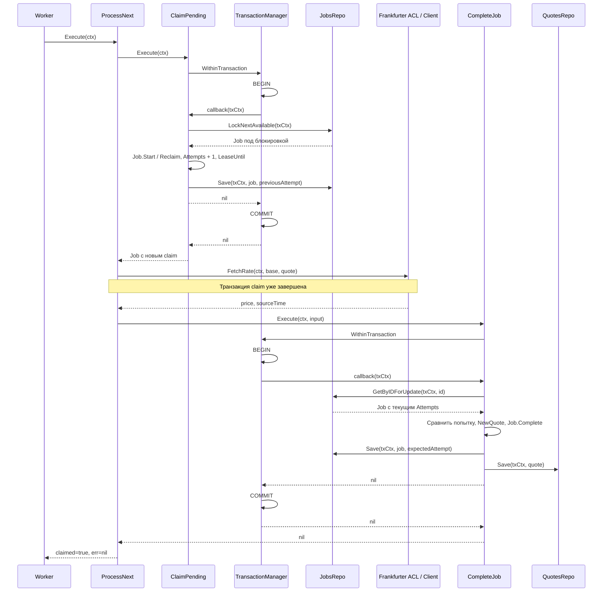

# Обработка джоб и надёжность

[Главная](../README.md) · [Документация](README.md) · [Домен](domain.md) · [Провайдер](provider.md)

Очередь — таблица `quote_jobs` в PostgreSQL. Воркеры работают в том же
процессе, что HTTP. POST только сохраняет задачу; получение курса выполняет
[ProcessNext](../internal/usecase/process_next.go).

Доработки протокола и его связь с HTTP-идемпотентностью собраны в
[документе об идемпотентности, джобах и stateless](reliability.md).

<a id="processing"></a>

## Одна попытка обработки



Границы транзакций определяет usecase через `TransactionManager`.
Реализация в [pkg/postgres/transaction.go](../pkg/postgres/transaction.go) открывает
`pgx.Tx` и передаёт его через приватный ключ контекста. Оба репозитория
используют один tx. Ошибка callback или panic приводит к rollback; ошибка
commit также возвращается вызывающему коду. Если tx уже есть в контексте,
менеджер использует его; commit/rollback выполняет внешняя операция.
Это позволяет [middleware идемпотентности](idempotency.md) сохранить новую
джобу и исходный HTTP-ответ одним commit.

Rollback выполняется с отдельным контекстом до 5 секунд, сохраняющим values,
но не отмену исходного запроса. Это позволяет освободить транзакцию после
timeout. SQL-модификации и блокировки требуют tx; простое чтение latest
может выполняться через пул без отдельной транзакции.

Complete сохраняет статус Job и Quote атомарно. Если вставка цены не проходит,
обновление Job также откатывается. Уникальный индекс по `quote_values.job_id`
не допускает две котировки одной джобы. Схема и конвертеры находятся в
[job.Repository](../internal/repo/postgres/job/repository.go),
[quote.Repository](../internal/repo/postgres/quote/repository.go)
и [миграциях](../migrations).

<a id="lease"></a>

## Конкуренция и lease

Claim выбирает либо due-джобу в `pending`, либо `processing` с истёкшим или
отсутствующим `lease_until`. `FOR UPDATE SKIP LOCKED` позволяет другим
воркерам выбрать незаблокированные строки. После Start/Reclaim сохраняются
`attempts + 1` и `lease_until = now + JOB_LEASE_DURATION`, затем tx закрывается.

Complete и retry снова блокируют джобу через `FOR UPDATE`, требуют статус
`processing` и тот же номер попытки. `Save(ctx, job, expectedAttempt)`
дополнительно проверяет `attempts = expectedAttempt` в SQL. При claim
ожидается номер до Start/Reclaim; при complete/retry — номер, полученный
при claim. Обновление строки, которая уже находится в `pending`, допускается
только для начала новой попытки: целевой статус должен быть `processing`,
а число попыток — больше ожидаемого.
Так уже освобождённая попытка не может повторно сохранить результат или retry.
Если другой воркер уже сделал reclaim, прежний получает
`ErrClaimLost` и не может опубликовать результат.

Сценарий не проверяет срок lease при завершении: истечение срока делает
джобу доступной для reclaim, но пока номер попытки не изменился, она может
завершиться. Поэтому истечение lease и фактическая потеря claim различаются.
Протокол не использует heartbeat для продления lease.

Вызов внешнего источника может повториться после retry или падения процесса.
Гарантируется защита сохранённого результата номером попытки, транзакцией и
уникальным индексом; exactly-once вызов внешнего API не гарантируется. После
истечения аренды возможны пересекающиеся запросы старой и новой попыток.
Сервис stateless: состояние джобы и координация экземпляров находятся в БД.

<a id="retry"></a>

## Retry и завершение с ошибкой

При ошибке FetchRate запускается отдельная транзакция RetryJob. Она проверяет
claim, вызывает `Job.RetryOrFail` и сохраняет `next_attempt_at`. Задержка:

```text
min(RETRY_BASE × 2^(Attempts − 1), RETRY_MAX)
```

При стандартных настройках после ошибок первых попыток задержки равны
1, 2, 4 и 8 секунд. На пятой ошибке `MAX_ATTEMPTS=5` переводит джобу в
`failed`. Jitter не добавляется. Число попыток увеличивает Start/Reclaim,
а не RetryJob.

Некорректные данные, отвергнутые доменным конструктором котировки, также
приводят к retry. Невалидная сохранённая пара завершается через Fail без
обращения к источнику. Ошибки claim/БД/commit возвращаются воркеру; они не
выдаются за успешную обработку и не все автоматически вызывают RetryJob.

После отмены worker context retry/complete тоже могут быть отменены. Джоба
остаётся `processing` и позже доступна для reclaim. `MAX_ATTEMPTS` проверяет
именно ветка RetryOrFail: повторные падения процесса с одним лишь reclaim
не останавливаются отдельной проверкой лимита в ClaimPending.

Latest для пары читает самый поздний сохранённый результат по `created_at`.
Он не ждёт текущие задачи. [Статусы и ответы API](api.md#result).

<a id="shutdown"></a>

## Lifecycle и восстановление

Запуск, контексты и graceful shutdown описаны отдельно в [lifecycle.md](lifecycle.md).
App прекращает опрос очереди, даёт активным операциям завершиться, по
дедлайну отменяет их и ждёт выхода воркеров перед закрытием ресурсов.

Если результат не был сохранён, следующий процесс заберёт джобу после
истечения lease. Restart не удаляет её и не создаёт новый ID. См.
[состояние джобы при остановке](lifecycle.md#recovery) и
[границы гарантий](lifecycle.md#limits).
