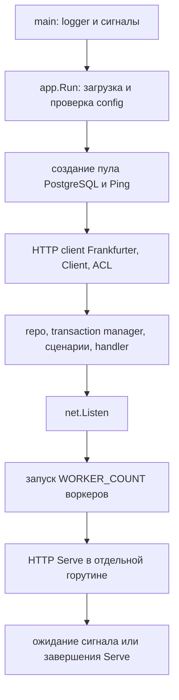
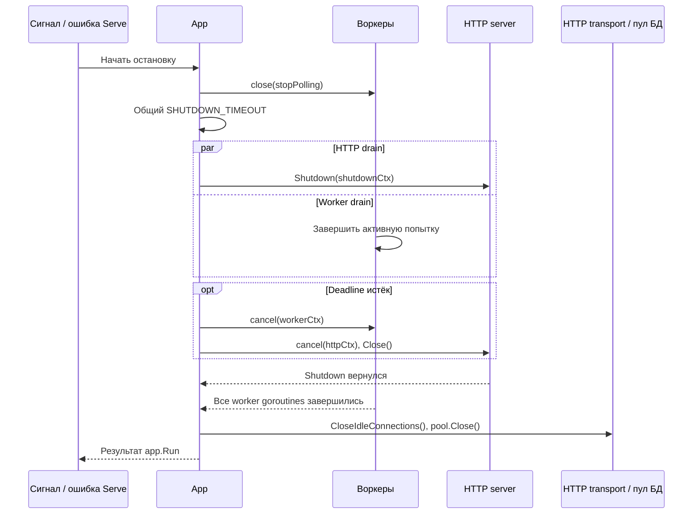

# Lifecycle: запуск и остановка приложения

[Главная](../README.md) · [Документация](README.md) · [Запуск](running.md) · [Trade-offs](trade-offs.md)

Lifecycle — технический цикл жизни процесса: сборка зависимостей, запуск
HTTP и воркеров, обработка причины остановки и освобождение ресурсов.
Он не меняет бизнес-статусы Job самостоятельно и не заменяет usecase.

<a id="ownership"></a>

## Кто чем владеет

| Место | Ответственность |
| --- | --- |
| [cmd/service/main.go](../cmd/service/main.go) | Логгер, `signal.NotifyContext` для SIGINT/SIGTERM, вызов app.Run, exit code при ошибке |
| [internal/app/app.go](../internal/app/app.go) | Загрузка конфига и создание пула, адаптеров, сценариев и HTTP server |
| [internal/app/lifecycle.go](../internal/app/lifecycle.go) | Listener, запуск горутин, остановка опроса, drain, отмена и закрытие ресурсов |
| [pkg/postgres/pool.go](../pkg/postgres/pool.go) | Создание пула и проверка подключения; закрывает его app |
| [pkg/httpclient/client.go](../pkg/httpclient/client.go) | Создание HTTP client с собственным transport и middleware |
| [pkg/httpserver/server.go](../pkg/httpserver/server.go) | Создание стандартного HTTP server с переданным handler и настройками |
| [worker.go](../internal/worker/worker.go) | Один цикл опроса; стоп опроса отдельно от отмены активной попытки |
| [pkg/postgres/transaction.go](../pkg/postgres/transaction.go) | Жизнь одной SQL-транзакции и rollback при завершении сценария |

Пул PostgreSQL и исходящий HTTP transport принадлежат приложению и
закрываются через `closeResources`. Usecase не закрывает их после каждого
вызова. Migrator запускается отдельным процессом и не является горутиной
service. Общие конструкторы вынесены в `pkg`, но listener, BaseContext,
запуск и порядок graceful shutdown остаются в `internal/app/lifecycle.go`.

<a id="startup"></a>

## Последовательность запуска



Конфиг проверяется до открытия ресурсов. Ошибка подключения не даёт
запустить listener. При ошибке создания клиента уже созданный пул и idle
HTTP connections закрываются. Если не удалось открыть HTTP-порт, app
закрывает ресурсы и возвращает ошибку, воркеры ещё не запускаются.

После успешного Listen создаются отдельные контексты HTTP и воркеров.
Каждый воркер начинает с немедленного прохода очереди и далее опрашивает
её по `POLL_INTERVAL`. Он последовательно выполняет одну попытку за раз;
параллельность задаётся числом воркеров. Все используют один ProcessNext
и общий пул, а транзакции каждой попытки независимы.
Ticker действует и при непустой очереди; это описано в [цикле воркера](jobs.md#polling).

App запускает `http.Server.Serve` и ждёт либо отмены корневого контекста,
либо результата Serve. `http.ErrServerClosed` не считается ошибкой;
другая ошибка Serve сохраняется и приводит к общей остановке.

<a id="contexts"></a>

## Контексты и каналы

| Объект | Назначение |
| --- | --- |
| Корневой `ctx` | Сигнал завершения всего приложения; также используется на startup |
| `workerCtx` | Активные попытки ProcessNext; отменяется при shutdown deadline |
| `httpCtx` | BaseContext HTTP server; служит родителем контекстов запросов |
| `stopPolling` | Закрывается при начале shutdown; прекращает цикл опроса |
| `workersDone` | Закрывается после WaitGroup всех воркеров |
| `serveErrors` | Буферизованный результат HTTP Serve |
| `shutdownCtx` | Общий deadline ожидания HTTP и воркеров |
| `httpDone` | Результат HTTP Shutdown |

HTTP и worker contexts создаются через `WithCancel(WithoutCancel(ctx))`.
Значения родителя сохраняются, но его отмена и deadline не наследуются.
Поэтому SIGTERM начинает shutdown, а не немедленно отменяет запрос курса.
App владеет их cancel-функциями.

На каждый входящий запрос middleware добавляет собственный timeout.
Он продолжает действовать и во время drain; graceful shutdown не продлевает
deadline конкретного handler. Отдельно исходящий HTTP client ограничивает
запрос курса `PROVIDER_TIMEOUT`. [Все настройки](configuration.md#variables).

<a id="shutdown"></a>

## Graceful shutdown



Закрытие `stopPolling` прекращает последующие проходы опроса, но не отменяет
ProcessNext, уже выполняющийся воркером. HTTP Shutdown закрывает listener
и idle connections, затем ждёт активные запросы. Ожидания HTTP и воркеров
идут одновременно, с одним budget, а не по 10 секунд на каждый этап.

Если всё завершилось до deadline, активная джоба может успеть сохранить
Quote и статус done. Приложение ждёт всех worker goroutines и возвращает
успех, если причиной остановки не была ошибка Serve.

Если deadline истёк, app отменяет контексты и вызывает HTTP Close. Контекстные
операции provider/pgx завершаются с ошибкой; менеджер пытается откатить
незавершённую транзакцию с отдельным rollback-контекстом.
App продолжает ждать выхода воркеров, затем освобождает ресурсы. Ошибка
deadline и другие ошибки объединяются и возвращаются в main.

Если HTTP Shutdown сам вернул ошибку, app также отменяет HTTP context и
вызывает Close; воркеры продолжают ожидаться в рамках общего deadline.
Ресурсы БД не закрываются только на основании того, что HTTP уже остановлен.

<a id="recovery"></a>

## Что происходит с джобой

| Момент остановки | Состояние и восстановление |
| --- | --- |
| До отправки claim commit | Незавершённая транзакция откатывается, claim не сохраняется |
| После claim, активная попытка успела завершиться | Complete атомарно сохраняет Quote и done; повтор не нужен |
| После claim, сеть/complete прерваны без сохранённого результата | Джоба остаётся processing и становится доступной после истечения lease |
| Retry успел сделать commit | Джоба pending с `next_attempt_at` либо failed при лимите |
| Номер попытки изменился из-за reclaim | Прежний воркер не может сохранить результат; новая попытка владеет джобой |

При ошибке commit результат может быть неопределён для клиента: сервер БД
мог успеть применить транзакцию до потери соединения. Поэтому нельзя по
одной сетевой ошибке обещать rollback уже выполненного commit. Дальнейшее
поведение определяется фактической записью в БД, статусом и lease.

Перезапуск не удаляет джобы и не создаёт им новые ID. Устройство обработки
и защиты номером попытки — в [документации джоб](jobs.md#lease).

<a id="limits"></a>

## Таймауты и границы гарантий

По умолчанию приложение ждёт `SHUTDOWN_TIMEOUT=10s`, Compose даёт
`stop_grace_period: 20s`. Docker сначала посылает SIGTERM, затем SIGKILL,
если контейнер не вышел. До пяти секунд дополнительно может занять rollback,
который использует контекст без отмены исходной операции.

Shutdown timeout — deadline drain, а не гарантия, что весь процесс завершится
ровно за это время. После отмены app ждёт воркеры; если добавленный адаптер
игнорирует ctx и зависает, Go не может принудительно остановить его горутину.
Клиент Frankfurter и pgx используют контекст. При изменении timeout
согласуйте запас Docker на выход и освобождение ресурсов.

При принудительном HTTP Close сервер не делает отдельный join всех handler
goroutines; app явно присоединяет именно воркеры. Обработчики используют
контекст и общие ресурсы, pool.Close ждёт возврата занятых соединений.
Это не обещание завершить произвольный handler, игнорирующий отмену.

Readiness сейчас проверяет Ping БД. Отдельного флага draining, периода
снятия из балансировщика перед остановкой или механизма независимого
перезапуска воркеров нет. Неожиданная ошибка Serve останавливает и HTTP,
и воркеры. [Компромиссы](trade-offs.md#implementation).

<a id="tests"></a>

## Проверки реализации

[lifecycle_test.go](../internal/app/lifecycle_test.go) проверяет завершение
всех активных воркеров до cleanup, отмену и join по deadline, остановку
polling при ошибке Serve, drain активного HTTP-запроса и отмену HTTP по deadline.

```bash
go test -race ./internal/app ./internal/worker
```

Ручная Docker-проверка включает SIGTERM во время запроса курса, чтение
сохранённого результата и короткий deadline с восстановлением по lease.
Команды запуска — в [running.md](running.md); настройки тестового источника
передаются через [Compose override](configuration.md#compose).
