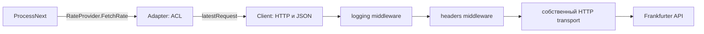

# Провайдер курсов: Frankfurter

[Главная](../README.md) · [Документация](README.md) · [Архитектура](architecture.md) · [Конфигурация](configuration.md)

<a id="choice"></a>

## Почему Frankfurter

В проекте выбран [Frankfurter](https://api.frankfurter.app) с базовым адресом
`https://api.frankfurter.app`.
Его контракт подходит текущему сценарию: запрос курса выбранной пары,
компактный JSON с базовой валютой, датой и значением. Для интеграции не
требуется отдельный SDK: достаточно HTTP-клиента и небольшого адаптера.
Настройки и клиент текущего проекта не используют API-ключ.

Сервис сохраняет результат запроса источника. Он не обещает биржевые цены
в реальном времени, непрерывную доставку изменений или более свежий курс,
чем вернул источник. Поле `date` разбирается как календарная дата
`YYYY-MM-DD` с временем `00:00:00 UTC`. Отличие от времени сохранения
описано в [Quote](domain.md#quote).

Провайдер изолирован в [internal/provider/frankfurter](../internal/provider/frankfurter).
Ограничения доступности и список валют не зашиты в домен: приложение
проверяет собственный список допуска, а ответ источника проверяет ACL.

<a id="adapter"></a>

## Клиент, внешние модели и ACL



| Файл | Ответственность |
| --- | --- |
| [models.go](../internal/provider/frankfurter/models.go) | Приватные `latestRequest`, `latestResponse` — формат внешнего API |
| [pkg/httpclient/client.go](../pkg/httpclient/client.go) | Собственный transport и общий timeout |
| [pkg/httpclient/middleware.go](../pkg/httpclient/middleware.go) | Общие middleware заголовков и логов, закрытие idle connections |
| [internal/app/app.go](../internal/app/app.go) | Сборка клиента с заголовками и настройками Frankfurter |
| [client.go](../internal/provider/frankfurter/client.go) | URL, GET, HTTP-статус, ограниченное чтение и JSON decoding |
| [adapter.go](../internal/provider/frankfurter/adapter.go) | Проверка ответа и перевод внешней модели в значения приложения |

`httpclient.New` клонирует стандартный transport и применяет middleware
в порядке передачи: logging → headers → transport. В `internal/app`
задаются timeout, сообщение `Frankfurter HTTP request` и заголовки
`Accept: application/json`, `User-Agent: currency-service/frankfurter`.
Пакет `pkg/httpclient` не содержит настроек или моделей конкретного провайдера.
Middleware логов записывает метод, HTTP-статус, длительность и ошибку без тела ответа.
Успешные обращения логируются на Debug, ошибки — на Warn; при стандартном
Info-логгере успешные исходящие запросы не отображаются. Контекст запроса
сохраняется, `CloseIdleConnections` проходит через всю цепочку middleware.

`Client.Latest` добавляет `/latest` к base URL и передаёт `from`/`to`:

```text
GET /latest?from=GBP&to=CHF
```

Пример ожидаемого формата, а не актуальная котировка:

```json
{"date":"2026-10-01","base":"GBP","rates":{"CHF":1.109}}
```

Числа читаются как `json.Number`. ACL переводит значение напрямую в
`decimal.Decimal`, не используя `float64`, и возвращает `(price, sourceTime)`.
Внешняя структура не выходит за пределы пакета провайдера.
`NewClient` принимает `ClientConfig` с `BaseURL`; timeout находится в
`ServiceConfig.FrankfurterHTTP` и передаётся общему HTTP client при композиции.

Порт [RateProvider](../internal/usecase/process_next.go) объявлен в сценарии,
который потребляет курс. `rateClient` объявлен у адаптера, `httpDoer` — у
HTTP-клиента. Композиция [internal/app](../internal/app/app.go) соединяет
реализации; usecase не импортирует Frankfurter.

<a id="failures"></a>

## Проверки и ошибки

Клиент отвергает HTTP-статусы вне 2xx, тело больше 1 MiB, повреждённый JSON
и несколько JSON-значений. ACL отвергает пустой ответ, некорректную дату,
другую base-валюту, отсутствие нужного rate и неположительный либо
неразбираемый курс. Сетевой timeout и отмена контекста возвращаются как ошибки.

Одна попытка обработки вызывает `FetchRate` один раз; дополнительного retry
на уровне приложения HTTP-клиента нет. Ошибка передаётся в `ProcessNext`,
который запускает [RetryJob](jobs.md#retry). Провайдер не открывает транзакцию,
не меняет Job и не решает, сколько попыток ей осталось.

Протокольные и сетевые ошибки сейчас обрабатываются одинаково через retry:
например, неизвестная источнику валюта не выделяется в отдельную постоянную
ошибку. После исчерпания попыток клиент видит публичное сообщение
`quote provider is temporarily unavailable`; детали остаются в логах.

<a id="replacement"></a>

## Как изменить источник

Для совместимого endpoint можно задать `PROVIDER_BASE_URL`, сохранив
контракт `/latest?from=...&to=...`, `date`, `base` и `rates`. Просто поменять
URL на API с другой схемой недостаточно.

Для другого контракта добавьте отдельный ресурсный пакет под
`internal/provider`: HTTP-клиент, внешние модели и ACL с реализацией
`FetchRate`. Подключите его в `internal/app`. Доменные сущности и HTTP DTO
сервиса не должны получать поля внешнего API. Сценарий работает с тем же
портом, если ему по-прежнему нужны только decimal и время источника.

При настройке новой валюты проверяйте обе стороны: собственный
[ALLOWED_CURRENCIES](configuration.md#currencies) и поддержку пары источником.
Тестовый Frankfurter-compatible endpoint удобен для контролируемых timeout,
ошибок и проверки точности; он не заменяет проверку реальной интеграции.
