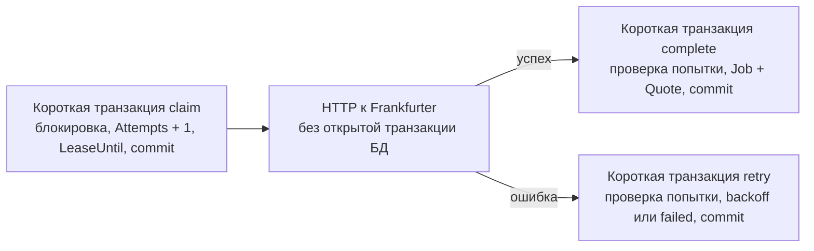

# Идемпотентность, обработка джоб и stateless

[Главная](../README.md) · [Документация](README.md) · [HTTP API](api.md) · [Архитектура](architecture.md)

Я вынес HTTP-идемпотентность из бизнес-сценария в middleware и упростил
обработку джоб до коротких транзакций, номера попытки и срока аренды.
При выборе я учитывал атомарность сохранения, восстановление после сбоя
и координацию нескольких экземпляров через БД. Здесь зафиксированы причины
изменений, текущий протокол, его гарантии и ограничения.

[Что изменилось](#changes) · [Идемпотентность](#idempotency) · [Обработка job](#jobs) ·
[Stateless](#stateless) · [Гарантии](#guarantees) · [Миграции](#migrations) · [Проверки](#checks)

<a id="changes"></a>

## История изменений протокола

Колонка «Раньше» описывает удалённые варианты. Актуальные контракты
приведены в колонке «Сейчас» и следующих разделах.

| Область | Раньше | Сейчас |
| --- | --- | --- |
| Ключ HTTP-запроса | Поле Job, input usecase, колонка `quote_jobs.idempotency_key` | Технические данные middleware и отдельная таблица `http_idempotency` |
| Повтор POST | Существующая Job, HTTP 200 и её текущий статус; другая пара давала конфликт | Сохранённые HTTP 202 и тело исходного успешного ответа, независимо от нового тела |
| Сохранение состояния job | Отдельный `JobUpdate` с параметрами обновления | `Save(ctx, job, expectedAttempt)`: состояние берётся из доменной Job |
| Владение попыткой | Отдельный UUID `LeaseToken` | Сохранённый `Attempts`, увеличиваемый при каждом start/reclaim |
| Восстановление зависшей job | Срок аренды | Срок аренды сохранён: номер попытки не определяет, сколько времени прошло |

Идемпотентность HTTP отвечает за повтор доставки запроса. Claim и `Attempts`
отвечают за конкуренцию воркеров и сохранение результата. Это разные механизмы:
одинаковый HTTP-ключ не запускает новую job, но обработка уже принятой job
может потребовать нескольких запросов к провайдеру.

<a id="idempotency"></a>

## HTTP-идемпотентность

Защищён маршрут `POST /v1/quote-updates`. Middleware читает необязательный
`Idempotency-Key`, проверяет его как техническое значение и передаёт в context.
Допустим корректный UTF-8 без нулевого символа, максимум 128 байт. Ключ остаётся
непрозрачной строкой и не нормализуется как валютная пара.

Без ключа каждый успешный POST создаёт новую job. С ключом первая успешная
операция сохраняет в `http_idempotency` статус, заголовки и байты тела ответа.
Job и usecase не содержат ключа и не проверяют дубли запроса.

### Первая операция и повтор

1. Middleware открывает транзакцию через менеджер.
2. Репозиторий вставляет ключ через `INSERT ... ON CONFLICT DO NOTHING` и читает строку `FOR UPDATE`.
3. При готовом ответе handler и usecase пропускаются; возвращается сохранённый ответ.
4. Для нового ключа handler декодирует JSON, а RequestUpdate создаёт доменную Job и сохраняет её.
5. HTTP-ответ сначала записывается в буфер, затем сохраняется в таблицу через тот же tx.
6. Middleware отправляет ответ только после commit.

`WithinTransaction` использует tx из context, если внешняя операция уже его
открыла. В таком случае usecase не создаёт отдельную транзакцию и не выполняет
свой commit. Завершает общую транзакцию middleware.

Уникальный ключ PostgreSQL сериализует конкурентные запросы между процессами.
Второй запрос ждёт первый: после commit читает его ответ, после rollback может
сам выполнить операцию. Ожидание ограничено deadline HTTP-запроса; истечение
deadline может дать 504, после которого клиент вправе повторить запрос.

### Какой ответ воспроизводится

Первый ответ создания:

```text
HTTP 202 Accepted
{"jobId":"b18e9a84-0cdf-46bb-889d-ed4a7235c367","status":"JOB_STATUS_PENDING"}
```

После завершения job повтор с этим ключом получает тот же 202 и то же тело
с pending. Актуальный done/failed и котировка читаются через GET по jobId.
`X-Request-ID` соответствует текущему HTTP-запросу.

Повтор определяется ключом: другое тело, другая пара и даже невалидный JSON
не заменяют уже сохранённый успешный ответ. Для другой операции клиент
использует новый ключ. Повтор не запускает завершённую или failed-job заново.

Сохраняются ответы 2xx. Ошибка handler, ошибка сохранения ответа, panic или
отмена до commit откатывает и новую Job, и ключ. После исправления запроса
можно использовать тот же ключ. Если процесс упал после commit, но до доставки
ответа клиенту, другой экземпляр вернёт сохранённый ответ без новой Job.

Код: [middleware](../pkg/httpserver/middleware/idempotency.go),
[idempotency repo](../internal/repo/postgres/idempotency/repository.go),
[RequestUpdate](../internal/usecase/request_update.go),
[менеджер транзакций](../pkg/postgres/transaction.go).
Подробности контракта и таблицы: [HTTP-идемпотентность](idempotency.md).

<a id="jobs"></a>

## Протокол обработки job

Состояние хранится в `quote_jobs`. Для координации важны четыре поля:

| Поле | Назначение |
| --- | --- |
| `Status` | Доступность job и допустимые переходы домена |
| `Attempts` | Число начатых попыток и идентификатор текущего захвата |
| `LeaseUntil` | Срок, после которого processing-job доступна для повторного захвата |
| `NextAttemptAt` | Время, с которого pending-job доступна после backoff |

`Attempts` заменяет отдельный токен владения. Это не общая версия агрегата:
значение увеличивают `Start` и `Reclaim`; complete и retry его не увеличивают.
Счётчик нельзя уменьшать или сбрасывать в течение жизни job.



### Claim и обращение к провайдеру

Claim выбирает pending-job с наступившим `NextAttemptAt` или processing-job
с истёкшим либо отсутствующим lease. `FOR UPDATE SKIP LOCKED` позволяет
конкурентным воркерам пропускать уже заблокированные строки и выбирать другие.

Usecase запоминает прежний `Attempts`, вызывает доменный `Start` или `Reclaim`,
сохраняет состояние через `Save` с прежним номером и делает commit. Воркер
получает Job с новым номером попытки. Пока аренда действует, новый claim этой
job не выполняется; разные jobs могут обрабатываться параллельно.

Запрос к Frankfurter выполняется после commit. Соединение и блокировка БД
не удерживаются на время сети. `PROVIDER_TIMEOUT` должен быть меньше
`JOB_LEASE_DURATION`; запас для работы БД выбирается настройкой. Конфиг
проверяет строгое неравенство, но не достаточность этого запаса.

### Complete, retry и защита от старого воркера

Complete/retry принимают `JobID` и `ExpectedAttempt`, открывают короткую
транзакцию и читают Job через `GetByIDForUpdate`. Продолжать разрешено только
при статусе processing и совпадении номера попытки. Состояние меняют доменные
методы, а repo сохраняет всю Job:

```go
Save(ctx context.Context, job *domain.Job, expectedAttempt int) error
```

SQL дополнительно проверяет текущий `Attempts` и допустимость обновления
статуса. Для pending разрешено только начало новой попытки с увеличением
счётчика. После retry номер ещё прежний, но статус уже pending: этого
достаточно, чтобы отвергнуть повторную запись освобождённой попытки.

После reclaim новая попытка имеет другой `Attempts`. Старый воркер получает
`ErrClaimLost` при complete/retry/Save и не может изменить результат новой
попытки. Воркеры логируют потерю claim на уровне Warn.

Complete сохраняет Job в done и Quote одной транзакцией. Ошибка вставки Quote
откатывает done; уникальный индекс по `quote_values.job_id` допускает максимум
одну Quote на Job. Ошибка получения курса вызывает RetryJob: pending с backoff
либо failed при достижении лимита. При retry/fail аренда очищается.

Срок lease не проверяется при complete: истёкшая аренда разрешает reclaim,
но сама по себе ещё не меняет номер попытки. Пока другой воркер не сделал
reclaim, текущая попытка может завершиться.

Код: [ClaimPending](../internal/usecase/claim_pending.go),
[проверка claim](../internal/usecase/claim.go),
[CompleteJob](../internal/usecase/complete_job.go),
[RetryJob](../internal/usecase/retry_job.go),
[job repo и Save](../internal/repo/postgres/job/repository.go).
Переходы статусов: [домен](domain.md#transitions); backoff: [обработка джоб](jobs.md#retry).

<a id="stateless"></a>

## Почему сервис stateless

Долговечное состояние запроса и обработки находится в PostgreSQL: сохранённый
HTTP-ответ, Job, номер попытки, сроки и Quote. Локальные mutex, карты ключей
и память конкретного воркера не определяют владение работой.

Процесс держит текущую Job, context и сетевой запрос только на время выполнения.
После перезапуска эти значения не восстанавливаются из памяти старого процесса:
любой экземпляр читает состояние из БД и продолжает протокол. Для повторного
POST не требуется попасть на ту же реплику.

| Момент сбоя | Состояние и восстановление |
| --- | --- |
| До commit принятия POST | Незавершённые изменения откатываются; клиент повторяет с тем же ключом |
| После commit, до получения ответа клиентом | Job и HTTP-ответ уже в БД; повтор возвращает сохранённый ответ |
| После claim или во время HTTP к провайдеру | Job остаётся processing; после lease другая реплика делает reclaim и увеличивает Attempts |
| Во время complete до commit | Job и Quote откатываются вместе; восстановление идёт после lease |
| После commit complete | Job done и Quote сохранены; job не берётся в работу повторно |

SIGTERM останавливает polling и даёт активной попытке завершиться. По дедлайну
shutdown контекст активных операций отменяется; если результат не сохранён,
job восстанавливается после lease. Подробнее: [lifecycle](lifecycle.md#recovery).

<a id="guarantees"></a>

## Гарантии и ограничения

| Свойство | Что обеспечивает текущий протокол |
| --- | --- |
| Повтор принятого POST с одним ключом | Исходный ответ и одна Job при сохранении таблицы идемпотентности |
| Несколько экземпляров сервиса | Общая координация через транзакции и блокировки PostgreSQL |
| Устаревшая или освобождённая попытка | Её запись отвергается проверкой статуса и Attempts |
| Завершение job | Job и Quote сохраняются атомарно; максимум одна Quote на job |
| Падение процесса | Незавершённую processing-job может забрать другая реплика после lease |
| Единственный внешний запрос при любых сбоях | Абсолютной гарантии нет: после истечения lease запросы могут пересечься |

Пример границы аренды: воркер A начал попытку 1; lease истёк при живом запросе;
воркер B захватил попытку 2 и тоже вызвал провайдера. Два запроса могут идти
одновременно, но попытка 1 уже не сможет сохранить результат. Именно эта
ситуация показывает границу lease. Stateless и корректность записи
не означают exactly-once обращение к внешнему API.

Heartbeat не используется. Сроки рассчитываются по времени процесса,
а доступность в SQL — по `now()` PostgreSQL; синхронизация часов важна.
`MAX_ATTEMPTS` проверяется в RetryOrFail: повторные падения и reclaim без
этой ветки могут увеличивать счётчик сверх лимита. Ключи HTTP глобальны для
защищённого POST; TTL и автоматическая очистка пока не реализованы.

<a id="migrations"></a>

## Миграции и совместимость

- [0003_attempt_claim.up.sql](../migrations/0003_attempt_claim.up.sql) удаляет `lease_token`; владение проверяется по Attempts. [Down](../migrations/0003_attempt_claim.down.sql) возвращает колонку, но не прежние токены.
- [0004_http_idempotency.up.sql](../migrations/0004_http_idempotency.up.sql) создаёт таблицу ответов, переносит прежние ключи и удаляет ключ из `quote_jobs`. Прежний код не хранил HTTP-ответ, поэтому миграция восстанавливает известный ответ создания 202/pending по jobId.
- [0004_http_idempotency.down.sql](../migrations/0004_http_idempotency.down.sql) возвращает ключи существующим Job и удаляет сохранённые HTTP-ответы.

Обновление выполняется с остановкой старых экземпляров, применением миграций
по порядку и запуском нового кода. Одновременно использовать старый и новый
протоколы на этой схеме нельзя. [Порядок запуска migrator](development.md#migrations).

<a id="checks"></a>

## Как проверяется поведение

| Критерий | Проверка |
| --- | --- |
| Исходные статус/тело, актуальный request ID, отсутствие успешного ответа до commit | [Тесты middleware](../pkg/httpserver/middleware/idempotency_test.go) |
| Повтор после завершения, другое тело, rollback Job и ответа, panic/отмена, миграция ключей | [HTTP и PostgreSQL](../internal/repo/postgres/idempotency_integration_test.go) |
| Использование общей транзакции и её завершение внешней операцией | [TransactionManager](../pkg/postgres/transaction_test.go) |
| Атомарность complete, устаревший claim, освобождённая попытка и backoff | [Repo integration](../internal/repo/postgres/repository_integration_test.go) |
| Drain активной работы, отмена по deadline и порядок закрытия ресурсов | [Lifecycle](../internal/app/lifecycle_test.go) |

Команды запуска тестов из репозитория описаны в
[разработке](development.md#tests); последовательность CI — в
[GitHub Actions](development.md#ci).
